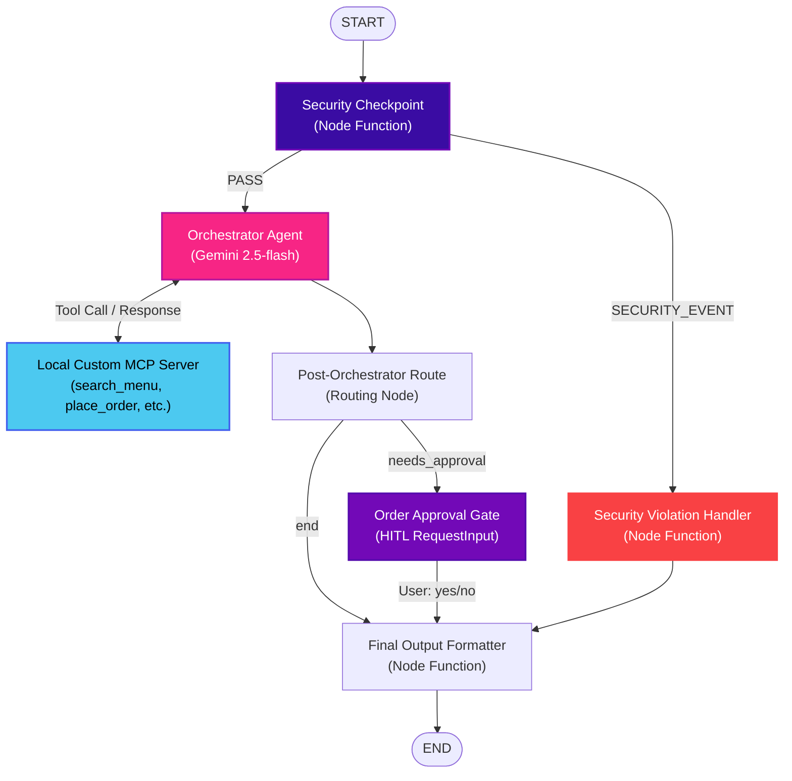

# 📄 ADK Smart Cafeteria Assistant - Submission Write-Up

## 1. Project Overview
The **ADK Smart Cafeteria Assistant** is an intelligent agentic workspace application designed to revolutionize cafeteria kiosk ordering. It utilizes the latest **ADK 2.0 multi-agent workflow graph framework** combined with **Gemini 2.5-flash** to deliver automated menu search, personalized dietary recommendations, order placement, order tracking, live inventory status, and sales analytics.

All operations are gated behind a **Security Checkpoint** (for PII scrubbing and prompt injection defense) and an **Interactive Human-in-the-Loop (HITL)** approval node. A high-performance custom **Model Context Protocol (MCP)** server exposes localized database actions to the agent workflow.

---

## 2. System Architecture & Workflow Graph
The system is modeled as a stateful directed graph using ADK 2.0's `Workflow` class. The state consists of:
* `user_query`: The original input string.
* `sanitized_input`: The cleaned query after PII filtering and prompt injection checks.
* `pending_order`: Details of the order currently requested and awaiting approval.
* `order_status`: Current status of order processing (e.g., Pending, Approved, Cancelled).

### 📐 Mermaid Diagram
Below is the architectural representation of the multi-agent system:

---

## 3. Custom MCP Server Configuration
A local stdio-based MCP server is implemented in `app/mcp_server.py` using the standard Python MCP SDK. It connects directly with the orchestrator workflow:

* **Exposed Tools**:
  1. `search_menu(query)`: Performs keyword search on active menu items (name, description, ingredients, tags).
  2. `place_order(items)`: Transitions order to pending status and logs transaction data.
  3. `track_order(order_id)`: Fetches progress (e.g., Preparation, Out for delivery).
  4. `check_inventory(item_name)`: Returns live stock levels for the requested ingredient/dish.
  5. `get_sales_analytics(period)`: Summarizes order totals and volume.
* **Integration**: Wired to the workflow agent set via `McpToolset` using `StdioConnectionParams` launching the server as a background process (`uv run python -m app.mcp_server`).

---

## 4. Security Checkpoint Guardrails
The pre-orchestration `security_checkpoint` function node protects the LLM and database layer:
* **PII Redaction**: Regular expression filters automatically scrub:
  * **Credit Card Numbers**: Pattern `\b(?:\d[ -]*?){13,16}\b` replaced with `[REDACTED_CC]`.
  * **Phone Numbers**: Pattern `\b(?:\+?\d{1,3}[- ]?)?\(?\d{3}\)?[- ]?\d{3}[- ]?\d{4}\b` replaced with `[REDACTED_PHONE]`.
* **Prompt Injection Defense**: Text scan searches for common injection patterns (e.g., *"ignore previous instructions"*, *"system prompt"*, *"forget what you were told"*). Violating requests bypass the orchestrator entirely, route to `security_violation`, and return a standard security warning.
* **Item Limit Enforcement**: Any requested order exceeding **20 items** is immediately rejected to prevent Denial of Service (DoS) load on the kitchen.
* **Structured Audit Logging**: Structured JSON events (Audit level) log the status of each check, including sanitized texts and block signals.

---

## 5. Human-in-the-Loop (HITL) Approval Gate
To prevent unauthorized transactions:
* When an order is placed via `place_order`, the state flag `needs_approval` triggers routing to the `order_approval` node.
* The `order_approval` node halts workflow execution and yields a `RequestInput(interrupt_id="approve_order", message="Please confirm your order...")`.
* The state is persisted. When the user responds with `"yes"` or `"no"`, the ADK server resumes execution at `order_approval` and retrieves the user's choice from `ctx.resume_inputs["approve_order"]`.
* Based on the user input, the assistant completes the placement or cancels the pending order.

---

## 6. Premium Responsive Kiosk UI
The web front-end is built as a single-page application using modern design tokens:
* **Rich Glassmorphism**: Translucent panels (`backdrop-filter: blur(16px)`), thin neon-purple borders, glowing status indicators, and responsive flex grids.
* **Dynamic Menu Grid**: Shows dish details, prices, and tag labels (Vegan, Gluten-Free). Items that are out of stock (e.g., Quinoa Bowl) are automatically greyed out, with ordering disabled.
* **Direct Order Integration**: Clicking the `+` button on any menu card automatically triggers an ordering request chat input to the AI assistant.
* **Native HITL Modals**: The front-end reads the `adk_request_input` event from the API response and displays a custom order confirmation dialog directly overlaying the chat, enabling one-click order approval.
* **Responsive Layout**: Adapts gracefully from wide desktop/tablet landscape (split-screen menu and chat) to mobile screens (vertical stacked panels).
